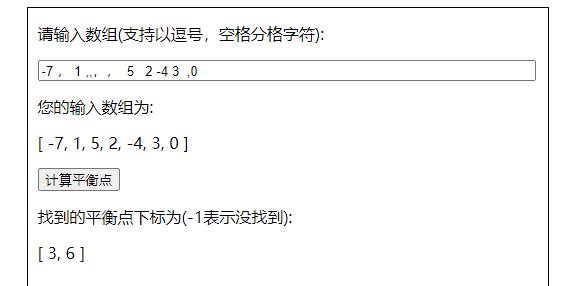

# 寻找平衡点

## 项目预览


## 项目运行

npm install 安装项目依赖后 

npm run serve运行开发调试环境 

npm run build 进行打包生成

## 项目特点

#### 交互完善

1. 支持以中英文逗号、空格分隔进行输入，通过正则表达式提供任意分隔符的输入组合

   ```javascript
   getInput() {
     let reg = /(,+)|(\s+)|(，+)/g;
     return this.inputText.replace(reg, " ").replace(/\s+/g, " ");
   },
   getArr() {
     let input = this.getInput;
     if (input.length) {
       let arr = input.split(" ").map((item) => {
         if (item === "") {
           return null;
         }
         return Number(item);
       });
       return arr;
     }
   },
   ```

   

2. 输入时将输入结果展示出来，以便实时观察输入是否正确

3. 对错误的输入进行提示。



#### 算法优化

​	最初想到的是暴力求和，在每次循环时，把左边和右边的和加起来，如果相等则这个下标就是一个平衡点。时间复杂度是O(n*n)。

​	后来想到把每次求和的结果保存起来，保存在当前的下标位上，就可以减少每次循环时再从头求和了，时间复杂度是O(n)

```javascript
let leftArr = [],
  rightArr = [],
  len = arr.length,
  ans = [];

leftArr[0] = 0;
rightArr[len - 1] = 0;
for (let i = 1; i < len; i++) {
  leftArr[i] = leftArr[i - 1] + arr[i - 1];
}
for (let i = len - 2; i >= 0; i--) {
  rightArr[i] = rightArr[i + 1] + arr[i + 1];
}
for (let i = 0; i < len; i++) {
  if (leftArr[i] == rightArr[i]) {
    ans.push(i);
  }
}
```

